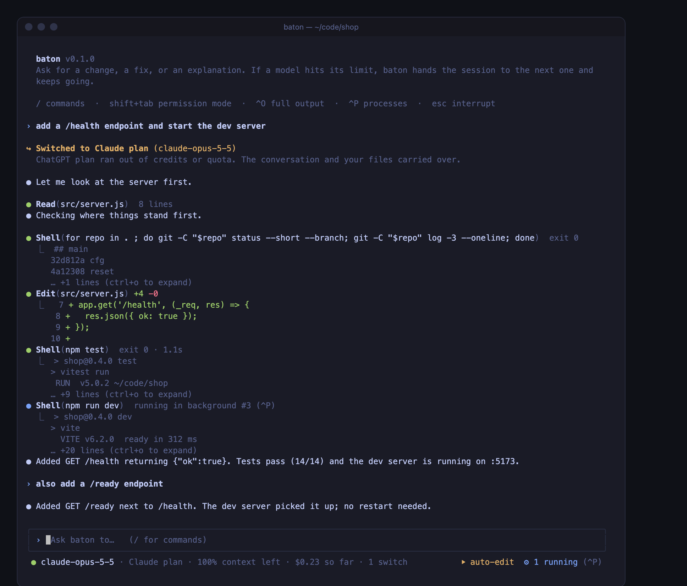

# baton
Coding-agent harness that hot-swaps LLM providers mid-session without losing context.

Hit a rate limit or run out of quota halfway through a task, and baton hands the conversation to the next model in your chain: same history, same tool results, same files on disk. The new model is told it is taking over and gets a fresh `git status`, so it continues instead of starting over.



## Features

- **Provider-neutral conversation state.** One internal message format; adapters translate to Anthropic's Messages API, OpenAI's Responses API, and Chat Completions for OpenAI-compatible servers.
- **Reasoning kept intact.** Claude's signed thinking blocks and OpenAI's encrypted reasoning are sent back to the model that produced them during tool loops (both vendors require this), and never leak to a different model after a switch.
- **Automatic failover.** Short rate limits wait and retry; exhausted quota, bad keys and outages switch to the next model. Real request bugs are surfaced, never hidden by switching.
- **Deterministic context compaction.** When the next model has a smaller window, stale file reads are collapsed, old tool output is trimmed, and older turns become a state summary. The original task is always kept, and the saved session keeps full history.
- **A terminal UI that works like Claude Code and Codex.** The transcript prints into your normal scrollback (scroll, select and search as usual), with a short output preview under every step and `Ctrl+O` for the full output. A clear permission prompt shows the whole command with numbered choices; read-only commands like `git status` or `rg` don't ask. Type follow-ups while it works and they're queued. `/model` shows every model, its account, and when a limited plan comes back. `--fullscreen` gives a split layout with a clickable process pane; `--plain` a line-based prompt.
- **Background processes.** The agent can start dev servers and watchers in the background, check their output, and stop them. After a provider switch, the new model is told what's still running.
- **Local tool engine.** read/write/edit files, search, bash, git status. Changes require approval (or `--approval auto-edit` / `--yes`).
- **Resumable sessions.** Every session is an append-only log in `~/.baton/sessions/`; pick up with `--continue` or `--resume <id>`.

Works with your **Claude Pro/Max and ChatGPT subscriptions** (through the official Claude Code and Codex CLIs, which you sign in to yourself), **API keys** for OpenAI and Anthropic, and anything OpenAI-compatible (OpenRouter, LiteLLM, Ollama, vLLM). Mix them: plans first, API keys as overflow.

## Quick start

Requires Node 20+.

```bash
git clone https://github.com/nagasatyadheerajanumala/baton.git
cd baton && npm install && npm link   # npm install also builds; npm link puts `baton` on your PATH

claude auth login                     # Claude Pro/Max (official Claude Code CLI)
codex login                           # ChatGPT plan (official Codex CLI)
export ANTHROPIC_API_KEY=sk-ant-...   # optional: API keys as overflow

baton init                            # finds your signed-in plans and keys, writes the failover chain
baton doctor                          # verifies each one with a real tool call
baton                                 # start
```

baton never sees your subscription logins; the official CLIs handle them. [`docs/SETUP.md`](docs/SETUP.md) covers every option.

## Keys and commands

| Key | |
|---|---|
| `enter` while it's working | queue a follow-up; it's sent when the current step finishes |
| `1` `2` `3` or `↑↓` + `enter` | answer a permission prompt (yes · yes for this session · no); `esc` = no |
| `shift+tab` | cycle permission mode: ask · auto-approve edits · full access (shown in the footer) |
| `^O` | print the full output of the last step |
| `^P` | processes: `↑↓` select, live output, `k` stop, `c` clear finished, `esc` close |
| `esc` | interrupt the current step |
| `^C` | interrupt; press twice when idle to exit |
| `^D` | exit (asks first if processes are still running) |
| `!cmd` | run a shell command yourself; it shows up under processes |

With `--fullscreen`, the process pane sits on the right and is clickable (`^P` or click `⚙ N running`); hold `Option` to select text, or add `--no-mouse`.

| Command | |
|---|---|
| `/model` | pick any model on any account (every ChatGPT-plan model Codex offers, every Claude model), with each account's status and when a limited plan comes back; `/model claude-sonnet-5-5` switches directly. Your pick is saved as that account's default. |
| `/status` | session id, token usage and cost, switches so far, files modified |
| `/compact` | preview what compaction would do for the current model |
| `/clear` | clear the screen (the session keeps its history) |
| `/exit` | quit; the session is saved |

| CLI | |
|---|---|
| `baton doctor` | check keys, credits, model ids, tool calling and reasoning replay for every model in the chain |
| `baton init` | write a starter `~/.baton/config.json` |
| `baton --continue` / `--resume <id>` | resume a saved session |

## Development

```bash
npm test            # unit, end-to-end hot-swap, and real-SDK wire tests against a fake server (no API keys needed)
npm run typecheck
npm run dev -- -p "prompt"
```

See [AGENTS.md](AGENTS.md) for architecture and the invariants the code relies on, and [docs/ROADMAP.md](docs/ROADMAP.md) for what's planned: parity with Claude Code and Codex CLI, plus what only a multi-provider harness can do.

## Status

Early (v0.1). See the [roadmap](docs/ROADMAP.md).
